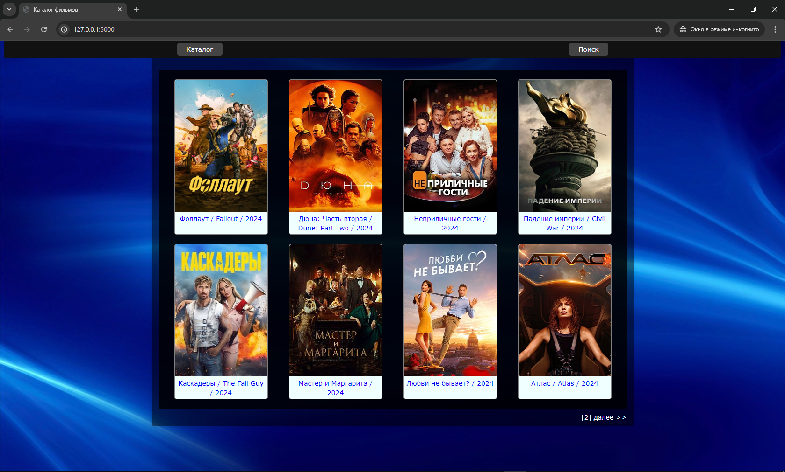
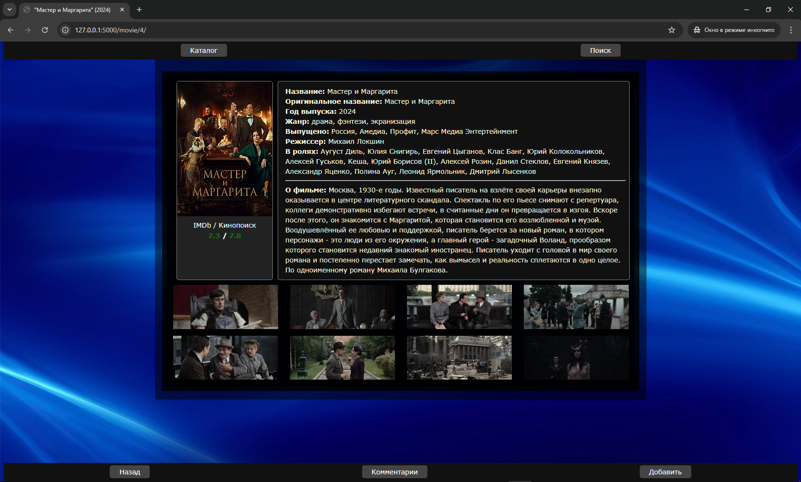
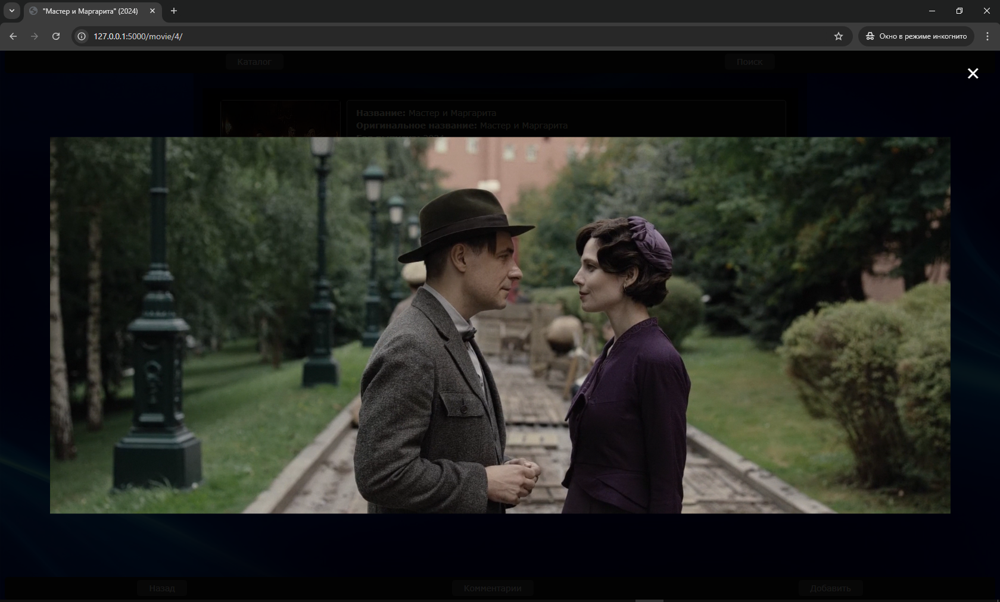
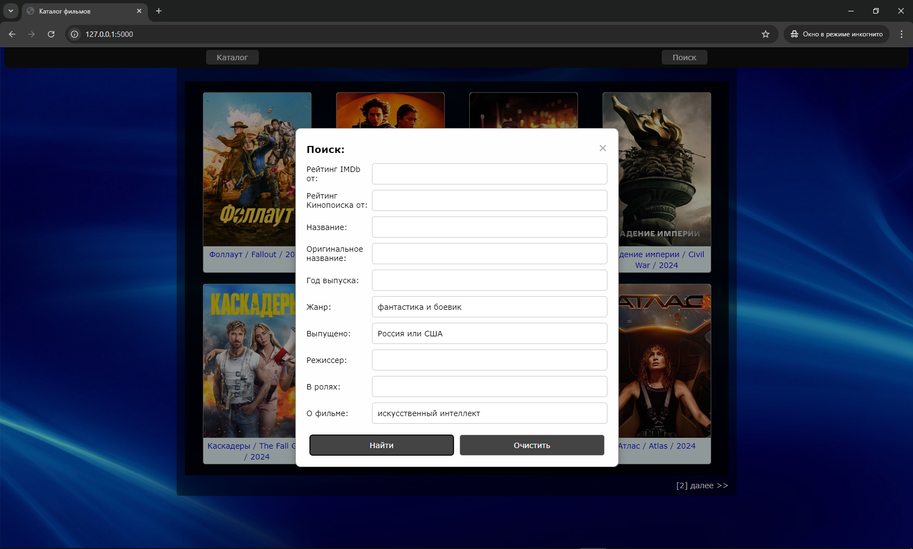
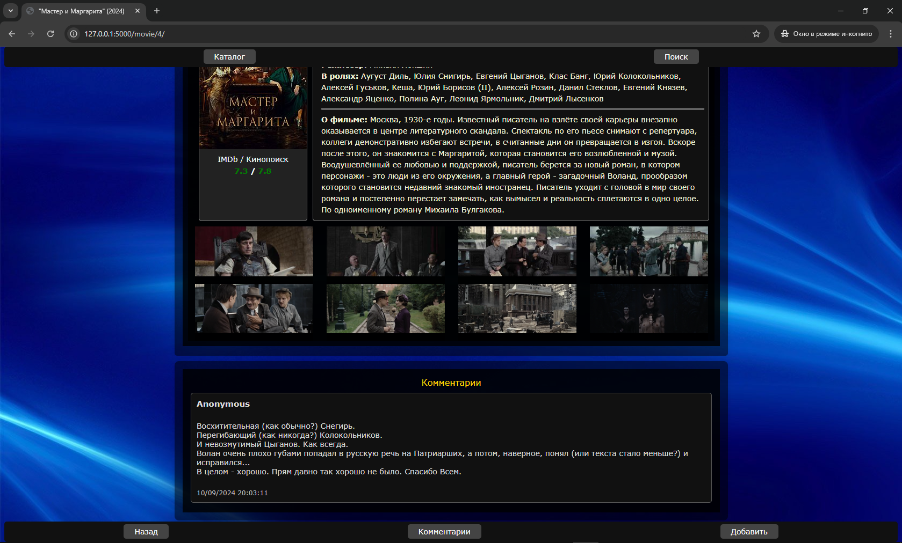
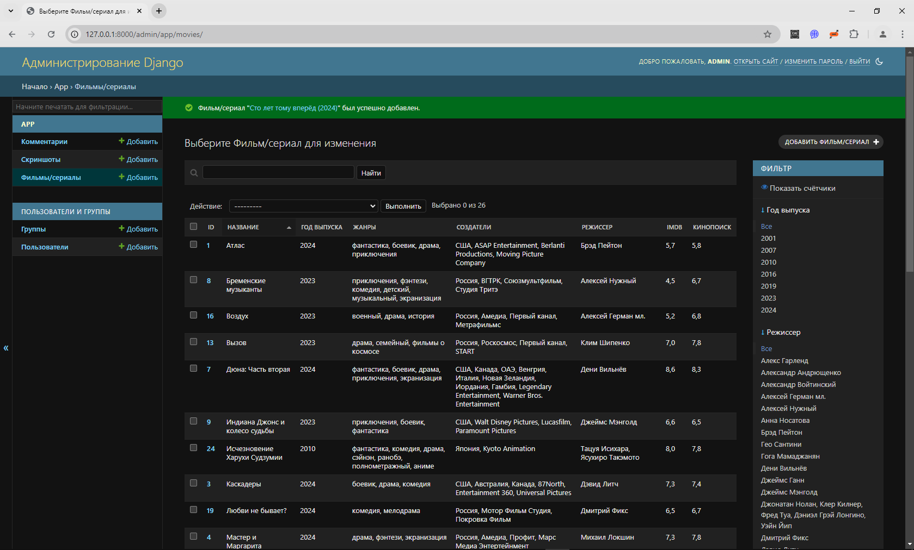

## Дипломная работа по теме "Анализ и сравнение написания web-приложений с использованием разных фреймворков"

### Выполнил: студент Рагалевич М.В., курс "Разработчик Python", Urban University

## СОДЕРЖАНИЕ

1. Задачи проекта [>>](#1)
2. Описание проекта [>>](#2)
3. Реализация проекта [>>](#3)
     - Внешний вид и дизайн [>>](#3.1)
     - Реализация проекта на Flask [>>](#3.2)
     - Реализация проекта на FastAPI [>>](#3.3)
     - Реализация проекта на Django [>>](#3.4)
4. Сравнение фреймворков Flask, FastAPI и Django [>>](#4)

## 1. Задачи проекта

Целью данного проекта является сравнение основных возможностей востребованных на рынке web-фреймворков на базе `Python`: `Flask`, `FastAPI` и `Django`. Необходимо реализовать небольшое веб-приложение на каждом из них, провести сравнение по степени применения, удобству разработки и сопровождения.

## 2. Описание проекта

В качестве темы для разработки я выбрал создание `Базы данных фильмов и сериалов`. Разработанные web-приложения должны обеспечивать выполнение следующих функций:

1. Ознакомление с содержимым каталога с возможностью просмотра постера, названия фильма и года производства фильма/сериала.
2. Просмотр подробной информации о выбранном фильме, включая:
     - название на русском языке
     - название на языке оригинала
     - год выпуска
     - жанр (один или несколько)
     - выпущено (страна и компания производитель)
     - режиссер
     - в ролях (ФИО основных актеров)
     - о фильме (краткое описание фильма/сериала для ознакомления)
3. В случае, если для фильма есть скриншоты, должна быть возможность их просмотра как в миниатюре, так и в полноразмерном формате.
4. Возможность поиска по любым параметрам фильма/сериала, включая сложный поиск по нескольким параметрам одновременно.
5. Возможность просмотра и добавления комментариев.

### 3. Реализация проекта

#### 3.1. Внешний вид и дизайн

Дизайн разработанных сайтов на каждом фреймворке выглядят одинаково, отличия заключаются в портах на которых они работают. Ниже представлены изображения, относящиеся к реализации сайта на `Flask`:

Главная страница каталога

Карточка фильма с подробной информацией

Просмотр полноразмерного скриншота

Пример расширенного поиска по БД

Пример добавления комментария

Комментарий после добавления

Документация Swagger(версия для FastAPI

Добавление нового фильма (версия для Django)

Административная панель (версия для Django)

Более подробно работа с версиями сайта на `Flask`, `FastAPI` и `Django` представлена в руководствах пользователя [здесь](Flask/README.md), [здесь](FastAPI/README.md) и [здесь](Django/README.md).

#### 3.2. Реализация проекта на Flask

Так как это учебное приложение, не предусматривающее большую нагрузку, в качестве БД был выбран `sqlite`. ORM не использовалась, доступ к БД осуществлялся только через "чистые" SQL-запросы. 

Основная работа осуществляется через скрипт [server.py](Flask/server.py), который принимает входящие HTTP запросы на сайт, запрашивает данные из БД через объекты файла [database.py](Flask/database.py), получает ответ и передает его в шаблон на рендеринг страницы. В качестве движка рендера используется `Jinja2`.

Обобщенные параметры реализации проекта на `Flask`:

| Движок БД | ORM | Миграция БД | Рендер страниц | Админ. панель | Асинхронность |
|-----------|-----|-------------|----------------|---------------|---------------|
|  sqlite   | нет |     нет     |     Jinja2     |      нет      |     нет       |

---

P.S: под асинхронностью понимается асинхронность "из коробки" 

**Субъективные оценки** по шкале от __1__ до __5__, где __1__ - худшая, __5__ - лучшая оценка:

- Скорость разработки: 4
- Удобство добавления данных: 2
- Скорость работы приложения: 3

**Общие впечатления**: удобно работать, импорты не перегружены объектами. Приятно видеть сразу декоратор и обработчик в одном файле. Интуитивно легко понять назначение объектов фреймворка по их названию.

#### 3.3. Реализация проекта на FastAPI

По аналогичным причинам, указанным в [п.3.2.](#3.2) в качестве БД выбран `sqlite`. В качестве ORM использовалась `SQLAlchemy`, а в качестве системы по управлению миграциями БД был выбран `Alembic`. 

Основной точкой входа в приложение является файл [main.py](FastAPI/main.py), который запускается через асинхронный ASGI web-сервер `uvicorn`, который принимает входящие HTTP запросы на сайт, запрашивает данные из БД используя объекты `SQLAlchemy`, получает ответ и после обработки передает его в шаблон на рендеринг страницы. В качестве движка рендера используется `Jinja2`.

Обобщенные параметры реализации проекта на `FastAPI`:

| Движок БД |     ORM    | Миграция БД | Рендер страниц | Админ. панель | Асинхронность |
|-----------|------------|-------------|----------------|---------------|---------------|
|  sqlite   | SQLAlchemy |   alembic   |    Jinja2      |      нет      |      да       |

---

**Субъективные оценки** по шкале от __1__ до __5__, где __1__ - худшая, __5__ - лучшая оценка:

- Скорость разработки: 3
- Удобство добавления данных: 4
- Скорость работы приложения: 5

**Общие впечатления**: есть как свои плюсы, так и минусы. Плюсом является скорость работы, потому, что фреймворк является полностью асинхронным, но программировать не очень удобно из-за большого количества объектов и классов фреймворка и перегрузки количества импортов в написанном коде. Также к плюсам можно отнести то, что декоратор и обработчик находятся рядом в одном файле. Удобное тестирование решения и получение документации через `Swagger` (но это больше касается решений по созданию API, а не для создания сайтов). База данный строится на основе моделей `SQLAlchemy`, что с одной стороны является плюсом, так как позволяет не привязываться к определенной СУБД, но с другой требует дополнительного изучения объектов и методов самой `SQLAlchemy` которые часто не являются интуитивно понятными. Таким образом, для экспертной эффективной работы с данным фреймворком нужен определенный опыт и знания.

#### 3.4. Реализация проекта на Django

По аналогичным причинам, указанным в [п.3.2.](#3.2) и [п.3.3.](#3.3) в качестве БД выбран `sqlite`. В качестве ORM использовалась `Django ORM`, а в качестве системы по управлению миграциями также используется `Django`. Никаких дополнительных инструментов для поддержки миграций устанавливать не требуется.

Все основные функции, включая создание проекта, приложения, запуск или работу с миграциями выполняются через системный файл `manage.py`. Фреймворк требует от разработчика соблюдение определенной дисциплины, поэтому весь написанный код должен находиться в определенных файлах, например модели приложений или отображения (views) должны находиться в файлах [models.py](Django/project/app/models.py) и [views.py](Django/project/app/views.py) в корне каталога приложения. А файл с маршрутами [urls.py](Django/project/project/urls.py) должен находиться в корне каталога проекта.

Обобщенные параметры реализации проекта на `Django`:

| Движок БД |     ORM    | Миграция БД | Рендер страниц | Админ. панель | Асинхронность |
|-----------|------------|-------------|----------------|---------------|---------------|
|  sqlite   | Django ORM |   Django    |       DTL      |      да       |     нет       |

---

P.S: под асинхронностью понимается асинхронность "из коробки" 

**Субъективные оценки** по шкале от __1__ до __5__, где __1__ - худшая, __5__ - лучшая оценка:

- Скорость разработки: 3
- Удобство добавления данных: 5
- Скорость работы приложения: 3

**Общие впечатления**: основным минусом работы с `Django` я считаю не самую быструю скорость работы (`FastAPI` работает значительно быстрее), но это не перекрывает плюсы фреймворка: наличие четкой структуры проекта дисциплинирует разработчика, что положительно сказывается при совместной работе над большими проектами. Присутствие `Административной панели` "из коробки" позволяет удобно манипулировать данными, включая полный CRUD. К минусам могу отнести стандартный шаблонный язык `Django` (Django Template Language), который не до конца совместим с `Jinja2`, хотя и имеет такой же синтаксис. Но если быть до конца честным, `Django` позволяет настроить `Jinja2`, но это требует дополнительных манипуляций со стороны разработчика. Другим минусом считаю интуитивно непонятный перевод `Django` из режима отладки в 'боевой' режим, т.к. это требует изменения не только `DEBUG`, но и других параметров (`ALLOWED_HOSTS`, настройки статики и т.д.). Но это мое чисто субъективное мнение.

### 4. Сравнение фреймворков Flask, FastAPI и Django

Выведем полученные обобщенные параметры всех фреймворков для анализа.

| Framework | Движок БД |     ORM    | Миграция БД | Рендер страниц | Админ. панель | Асинхронность |
|-----------|-----------|------------|-------------|----------------|---------------|---------------|
|   Flask   |  sqlite   |    нет     |     нет     |     Jinja2     |      нет      |      нет      |
|  FastAPI  |  sqlite   | SQLAlchemy |   alembic   |     Jinja2     |      нет      |      да       |
|   Django  |  sqlite   | Django ORM |   Django    |       DTL      |      да       |      нет      |

---

P.S: под асинхронностью, как и в предыдущих случаях, понимается асинхронность "из коробки".

**Субъективные оценки**, полученные в процессе разработки по шкале от __1__ до __5__, где __1__ - худшая, __5__ - лучшая оценка:

|           Параметр         |   Flask   |  FastAPI  |   Django  |
|----------------------------|-----------|-----------|-----------|
| Скорость разработки        |     4     |     3     |     4     |
| Удобство добавления данных |     2     |     4     |     5     |
| Скорость работы приложения |     3     |     5     |     3     |

**Выводы**:

Каждый фреймворк имеет свою нищу для применения, несмотря на свои плюсы и минусы.
Таким образом, можно выделить основные моменты.

**Flask**:

- **Плюсы**: Легковесный и гибкий, легко осваивается, большое сообщество и много расширений.
- **Минусы**: Ограниченный функционал "из коробки", для сложных проектов требует больше настроек.
- **Когда использовать**: Идеален для небольших проектов, прототипов, микросервисов или простых API.

**FastAPI**:

- **Плюсы**: Высокая производительность, поддержка асинхронности, автоматическая генерация документации.
- **Минусы**: Новое сообщество, меньше готовых решений.
- **Когда использовать**: Отличен для высоконагруженных API и приложений с большим количеством запросов.

**Django**:

- **Плюсы**: Полный набор инструментов для разработки веб-приложений, безопасность, быстрое прототипирование.
- **Минусы**: Тяжелый для небольших проектов, сложнее в освоении.
- **Когда использовать**: Подходит для крупных приложений с комплексной бизнес-логикой, таких как интернет-магазины и CRM-системы.

Done!